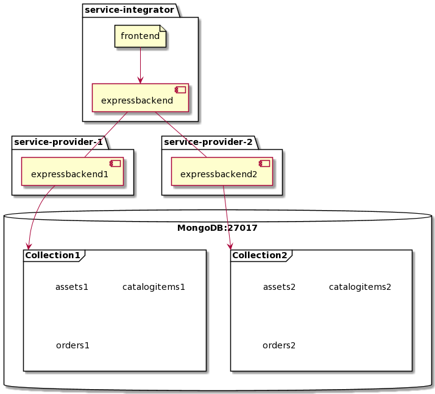

# service-integrator

One to two paragraph statement about your product and what it does.



## Installation

Make sure mongodb is running.
Set env variables.

Install dependencies:
```sh
npm install
```

Nodemon:

```sh
npm run dev
```

Node:
```sh
npm run dev
```
